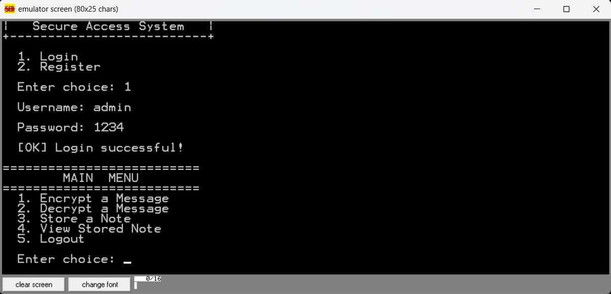
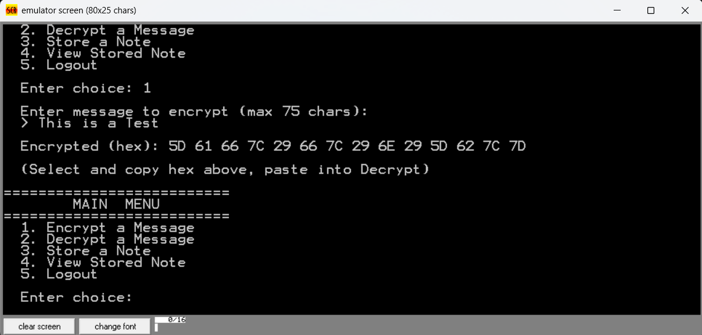
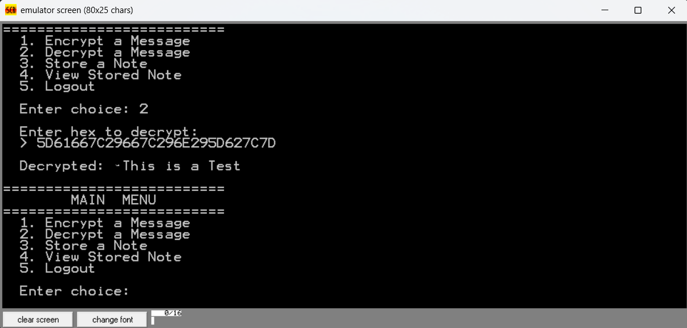
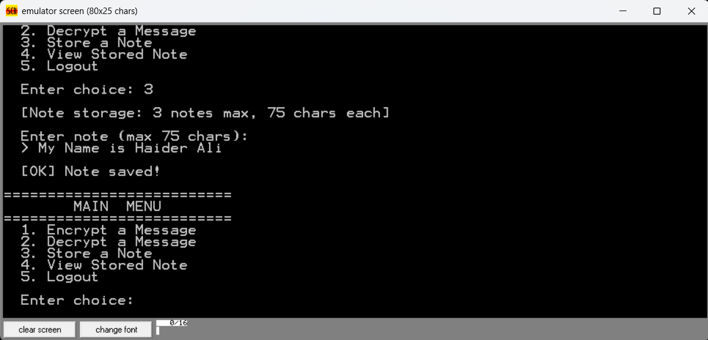
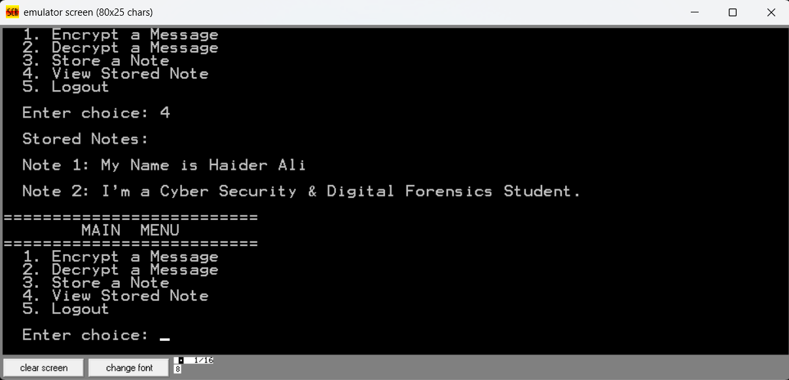

# NexLock — Secure Access System

A console-based secure access and data-protection system written in **x86 Assembly (16-bit, DOS/emulator target)**. NexLock simulates a lightweight authentication and encryption terminal — combining a login/registration system, a custom hex-based message cipher, and encrypted note storage — all built at the assembly level without relying on any high-level language or external library.

## Features

- 🔐 **User Authentication** — Login and Register flow with credential validation
- 🔑 **Message Encryption / Decryption** — Encodes plaintext into hex output and reverses it back on demand
- 🗒️ **Secure Note Storage** — Store up to 3 notes (75 characters each) during a session and retrieve them on request
- 🖥️ **Menu-Driven Interface** — Clean, numbered menu system for navigating all operations

## Tech Stack

- **Language:** x86 Assembly (16-bit)
- **Target/Runtime:** DOS-compatible emulator (e.g. emu8086 or similar)

## Project Structure

```
NexLock-Secure-Access-System/
├── Source_Code/
│   └── PROJECT.asm       # Core assembly source
├── screenshots/           # Demo screenshots of the running program
├── README.md
```

## How It Works

1. On launch, the user chooses to **Login** or **Register**.
2. After a successful login, the **Main Menu** presents five options:
   - Encrypt a Message
   - Decrypt a Message
   - Store a Note
   - View Stored Note(s)
   - Logout
3. Encryption converts an input message (max 75 characters) into a hex-encoded string. That same hex string can be pasted into the decrypt option to recover the original message.
4. Notes are stored in memory during the session and can be listed back at any time via "View Stored Note."

## Getting Started

1. Clone the repository:
   ```bash
   git clone https://github.com/haider-aliafzal/NexLock.git
   ```
2. Assemble and run `src/PROJECT.asm` in a DOS-compatible x86 emulator (e.g. emu8086).
3. Follow the on-screen menu to log in and explore the features.

## Screenshots

| Login & Main Menu | Encrypt a Message |
|---|---|
|  |  |

| Decrypt a Message | Store a Note |
|---|---|
|  |  |

| View Stored Notes |
|---|
|  |

## Author

**Haider Ali**
Cyber Security & Digital Forensics Student
